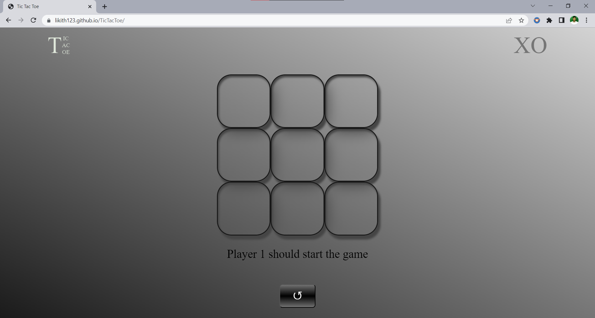
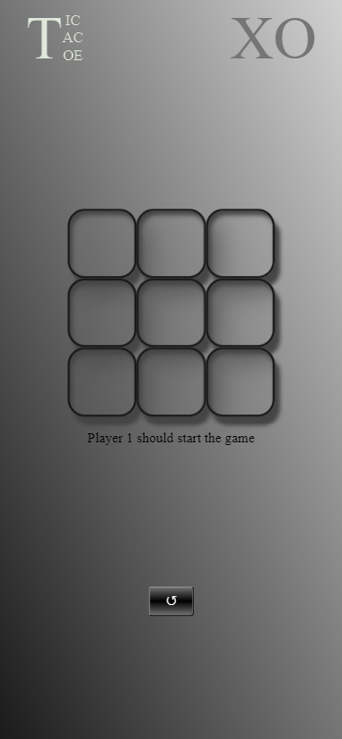
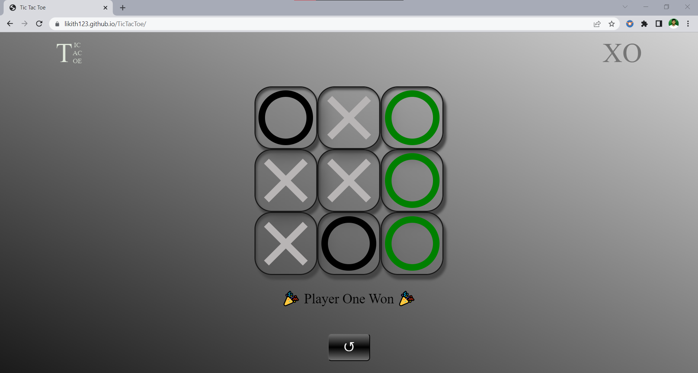

# Tic Tac Toe Project

### Check out this link for playing 👉 [https://likith123.github.io/TicTacToe/](https://likith123.github.io/TicTacToe/)

>  In general, **Tic Tac Toe** is a game where 2 players can play one after one on a 3 x 3 grid using **'O'** & **'X'** and there can be only 1 winner or a draw.

> A player wins when he/she make his/her respective option consecutively align in row or in column or diagonally.

- This is my personal project **Tic Tac Toe** game which can be played on a *responsive website*
- **O** is the playing option of Player 1 and **X** is the playing option of Player 2

- Here is the image of the game on my website

- I developed it using the following:

- [x] HTML
- [x] CSS
- [x] JavaScript

- This is a responsive website so that we can play on a device of any screen type and size like **PCs, Laptops, Mobiles, Tablets etc**

- On winning of a player, the color of the respective option of the winner turns to green like this 👇 

>  **"Hope you played and liked it, I'm open for any suggestions"**
